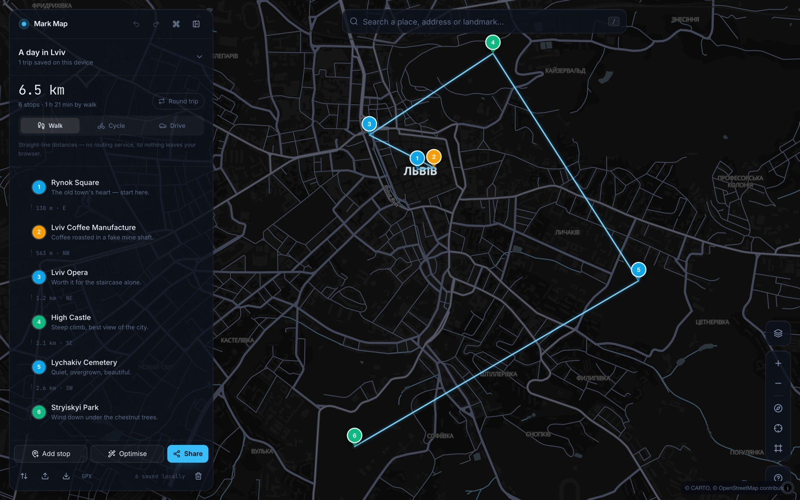
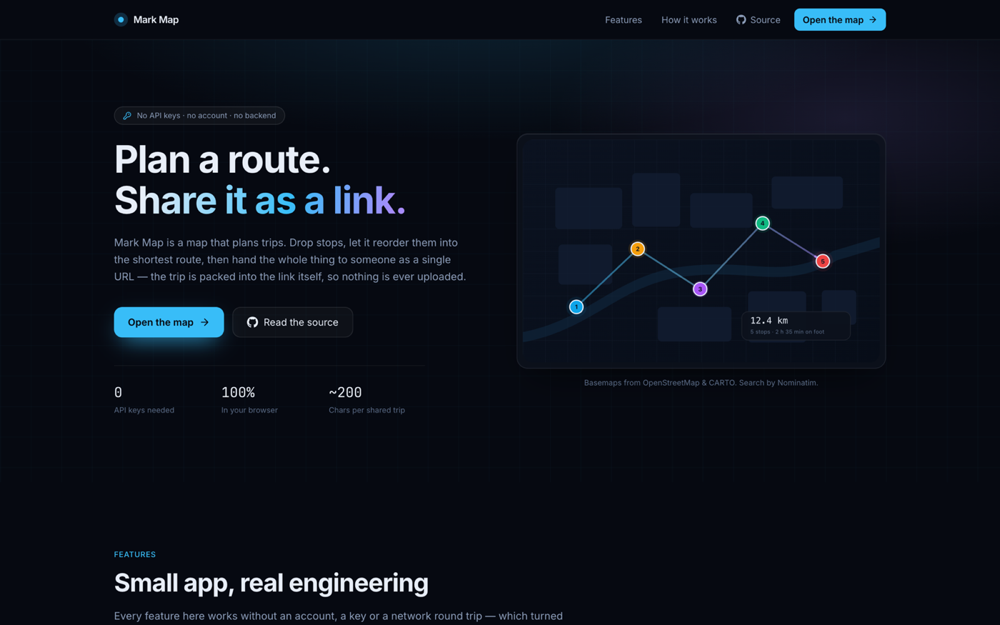
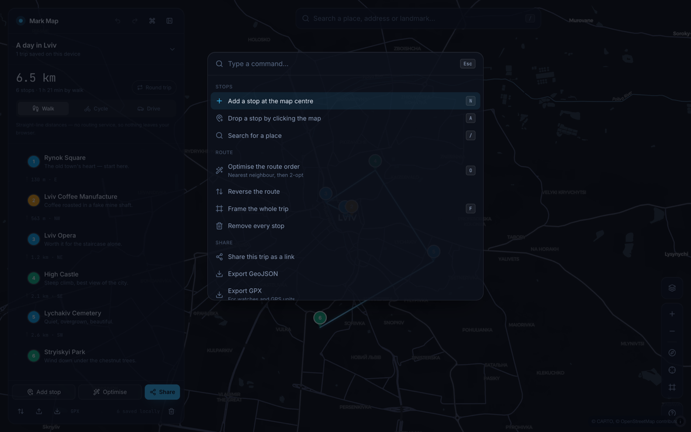
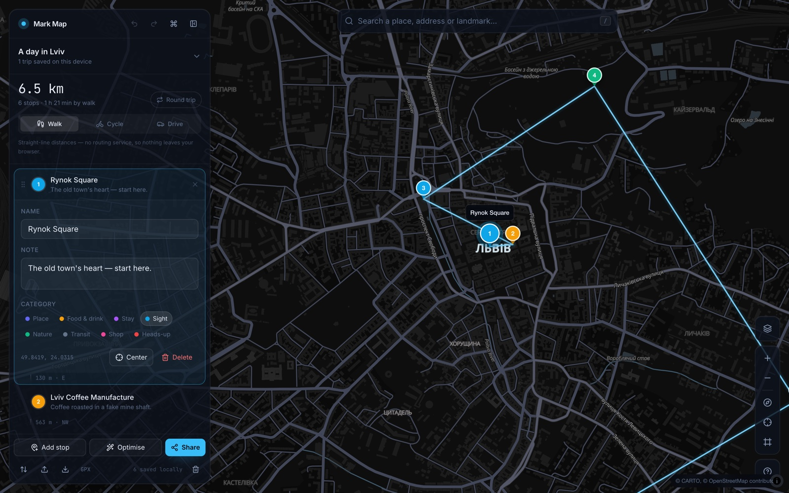
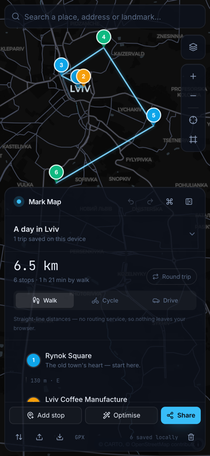

<div align="center">

# Mark Map

**Plan a route. Share it as a link.**

A keyless, local-first map and trip planner. Drop stops, let it reorder them into the
shortest route, then hand the whole trip to someone as a single URL — the stops travel
inside the link, so nothing is ever uploaded.

[](https://github.com/paliibo/mark-map/actions/workflows/ci.yml)
[](https://github.com/paliibo/mark-map/actions/workflows/deploy.yml)
[](LICENSE)


**[→ Open the live demo](https://paliibo.github.io/mark-map/)**

</div>



---

## Why it works this way

Most map apps need an API key before they show you anything. That makes them awkward to
run, awkward to demo, and awkward to hand to someone else.

Mark Map has no key, no account, no database and no server. It is a static site. Every
constraint that follows from that turned out to be the interesting part of building it:

| Without a server, you cannot… | So instead                                                              |
| ----------------------------- | ----------------------------------------------------------------------- |
| store trips                   | IndexedDB, written as you type — works offline, survives a closed tab   |
| share a trip by id            | the trip is packed into the URL fragment, ~200 characters for ten stops |
| call a routing API            | straight-line distances, and the ordering solved locally with 2-opt     |
| use a paid basemap            | MapLibre GL over OpenStreetMap vector tiles                             |

## Features

- **Route optimiser** — nearest-neighbour construction refined by a 2-opt sweep, for
  open routes and closed loops. Tells you how much shorter it made things, and it is
  one <kbd>⌘Z</kbd> away from undone.
- **Share by link** — the whole trip is delta-encoded into a binary frame and packed as
  base64url in the fragment. Fragments never reach a server, so a link works from any
  static host, forever.
- **Place search** — Nominatim geocoding, debounced and biased towards the current view.
  Pins dropped on the map name themselves by reverse lookup.
- **Drag anything** — reorder stops in the list, or drag a pin across the map; the route
  and its distances follow immediately.
- **Four basemaps** — Midnight, Daylight, Voyager and Satellite, all keyless.
- **GPX and GeoJSON** — export to a watch or a GPS unit, import from anything that emits
  waypoints.
- **Multiple trips**, each with its own stops, travel mode and loop setting.
- **Keyboard-first** — a command palette on <kbd>⌘K</kbd>, single-key shortcuts for every
  action, and sixty steps of undo.
- **Offline** — after the first visit, trips and the interface load with no network.

## Screenshots

|                                                     |                                                            |
| --------------------------------------------------- | ---------------------------------------------------------- |
|                |  |
| _Landing page_                                      | _Command palette (<kbd>⌘K</kbd>)_                          |
|  |                  |
| _Editing a stop in place_                           | _Bottom-sheet layout on mobile_                            |

## Running it

No `.env`, no accounts, no services to provision:

```bash
git clone https://github.com/paliibo/mark-map.git
cd mark-map
pnpm install
pnpm dev
```

Then open <http://localhost:3000>.

| Script            | What it does              |
| ----------------- | ------------------------- |
| `pnpm dev`        | Development server        |
| `pnpm build`      | Static export into `out/` |
| `pnpm test`       | Unit tests (Vitest)       |
| `pnpm typecheck`  | `tsc --noEmit`            |
| `pnpm lint`       | ESLint                    |
| `pnpm format:fix` | Prettier                  |

## How the share link works

`JSON.stringify` plus base64 blows past practical URL limits after a dozen stops, so a
trip is packed into a compact binary frame first:

```
u8      format version
u8      flags — bit 0 round trip, bits 1-2 travel mode
string  trip name           (varint length + UTF-8)
varint  stop count
per stop:
  svarint  latitude delta,  fixed point 1e-5 (~1 m)
  svarint  longitude delta
  u8       category
  string   name
  string   note
```

Consecutive stops in a trip are usually close together, so delta-coding the coordinates
keeps each one to two or three bytes instead of nine. The frame is then base64url-encoded
into the fragment. A ten-stop city trip lands at roughly 200 characters.

Opening such a link decodes it, previews the trip, and saves it only if you accept —
see [`src/lib/share.ts`](src/lib/share.ts) and [`tests/share.test.ts`](tests/share.test.ts).

## How the optimiser works

Ordering stops is the travelling salesman problem, which is intractable to solve exactly
past a couple of dozen points. [`src/lib/route.ts`](src/lib/route.ts) pairs the two
standard heuristics:

1. **Nearest neighbour** builds an initial tour by repeatedly hopping to the closest
   unvisited stop.
2. **2-opt** then repeatedly reverses the segment between two stops whenever doing so
   uncrosses the path, until a sweep finds no further improvement.

The first stop stays pinned, because it is the one you chose to start from. Closed loops
are handled by including the returning edge in the tour length. If the result is not
shorter than the order you already had, it is discarded rather than applied.

## Project layout

```
src/
  app/                     routes: landing page and /map
  components/
    landing/               marketing page sections
    map/                   MapLibre canvas, pins, camera and trip actions
    panel/                 trip list, route stats, stop editor
    overlays/              command palette, dialogs, toasts
    search/                Nominatim place search
    ui/                    buttons, dialog, form fields
  lib/
    geo.ts                 haversine, bearings, bounds, formatting
    route.ts               route building, nearest neighbour, 2-opt
    share.ts               the URL codec
    bytes.ts               varint reader and writer
    base64url.ts           environment-independent base64url
    io/                    GeoJSON and GPX, in and out
    geocode.ts             Nominatim client
    map-styles.ts          the four keyless basemaps
  store/                   Zustand stores: trips (with history) and UI
tests/                     Vitest suites over lib/ and store/
```

## Tests

Ninety-odd unit tests cover the parts where a quiet mistake would be invisible in the
UI — distance maths, the optimiser's invariants, codec round trips, and the import
parsers' tolerance for awkward files:

```bash
pnpm test
```

## Deployment

`pnpm build` produces a fully static `out/` that can be served from anywhere. The
included workflow publishes it to GitHub Pages on every push to `main` — enable it under
**Settings → Pages → Build and deployment → Source: GitHub Actions**. `NEXT_PUBLIC_BASE_PATH`
is set automatically so the same build works at a domain root or under `/mark-map`.

## Attribution

Map data © [OpenStreetMap](https://www.openstreetmap.org/copyright) contributors ·
vector tiles by [CARTO](https://carto.com/basemaps/) ·
place search by [Nominatim](https://nominatim.org/) ·
satellite imagery © Esri, Maxar, Earthstar Geographics.

Nominatim's [usage policy](https://operations.osmfoundation.org/policies/nominatim/) asks
for at most one request per second; the search box debounces input and aborts in-flight
requests on every keystroke to stay well inside that.

## Licence

[MIT](LICENSE)
